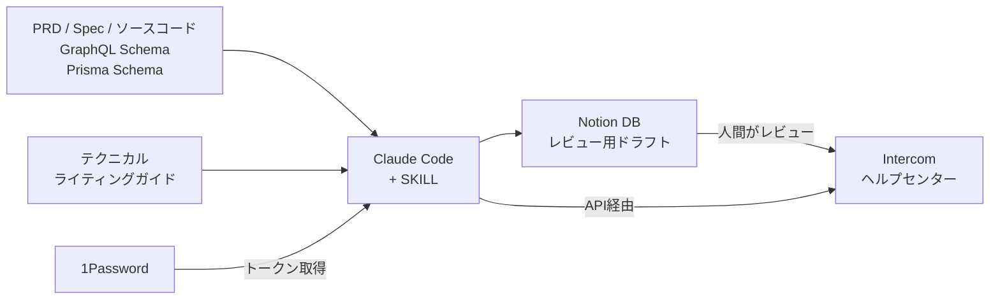
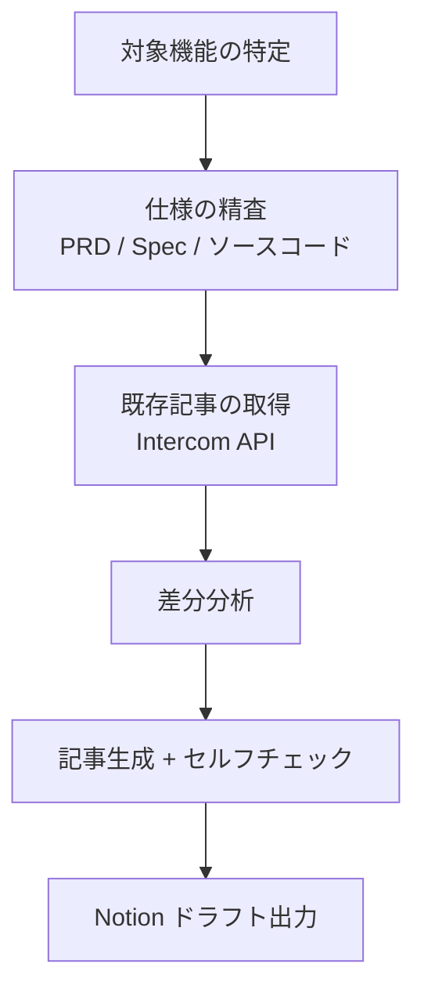

こんにちは。PeopleX エンジニアの([@Kill_In_Sun](https://x.com/kill_in_sun))です。

私は以前の職場で Customer Success 部門に所属しており、業務の中にヘルプページの運用というものをやっていました。

具体的には運用チームの立ち上げだったり、チーム内でヘルプページを書く勘所・・・いわゆるテクニカルライティングとしての知見を共有してチーム全員が同じ水準の記事を書けるように整備したりをしていました。

そんな経験を活かして、ソフトウェアエンジニアとして PeopleX で働いている今でも、弊社が提供しているヘルプページ（PeopleXではヘルプセンターと呼んでいるので、以降はそちらに統一します）を更新することがあります。

最近では、SNSで発信しているように短期間で多くのプロダクトをローンチする機会に恵まれていますが、それと同時にヘルプセンターの準備も必要で、ローンチ前の瀬戸際で猫の手も借りたい状況で「ヘルプセンター書くよ！」と動ける人はなかなかいません。

そこで今回の記事では Claude Code を使ってソースコードを読ませた上で Intercom 上にヘルプセンターをイチから構築した手順と、実際に31記事を生成した結果を紹介します。

## この記事で実現すること

<!-- TODO: Intercom のヘルプセンターに記事が並んでいるスクリーンショットを貼る -->

- テクニカルライターとしての知見を SKILL に落とし込み、AI が自律的に記事の作成・編集をできるようにする
- コレクション（いわゆるカテゴリ）分けも自動化する
- 変更を反映する前に、エンジニア以外のメンバーでもレビューができるフローにする
- API キーなどは 1Password で管理し、実行時に動的に取得する

今回は「イチから」と書いてありますが、すでに運用中のヘルプセンターでも取り入れることが可能です。

## 全体のアーキテクチャ

まずは全体像です。



ポイントは Intercom 上の記事を正とし、Notion はレビュー用の中間成果物として使うことです。

記事を書く際の情報源はソースコードです。私のチームでは PRD や仕様書を Git 管理下に置いています。それらに加え、GraphQL スキーマや Prisma スキーマ、フロントエンドのコンポーネントから仕様を読み取る方式を採用しました。

レビューフローについては、エンジニア以外のメンバーにも気軽に見てもらいたいため、全社横断で使っている Notion のデータベースにドラフトを出力し、そこでレビューを行います。レビューが通ったら Intercom に反映する流れです。

## SKILL 構成


```
.agents/skills/helpcenter/
├── SKILL.md                           # ワークフロー定義
└── references/
    ├── cli.tsx                         # Intercom API 操作 CLI
    └── technical-writing-guide.md     # テクニカルライティングガイド
```

`references/` ディレクトリにはドメイン知識やユーティリティスクリプトを配置でき、SKILL から参照できます。

テクニカルライターの暗黙知を `SKILL.md` と `technical-writing-guide.md` に明文化することで、AI が一貫した品質の記事を書けるようになります。

## Step 1: テクニカルライティングガイドを用意する

まずは AI にテクニカルライティングの知見を教えるためのガイドを作ります。これが記事の品質を左右する最も重要なファイルです。

代表的なものを抜粋すると、`references/technical-writing-guide.md` には以下を記述しました。

### 対象読者のペルソナ

記事の読者がどんな人かを明示します。

```markdown
- **管理者**: 人事部門・総務部門のスタッフ。導入・設定・運用を担当する
- **一般ユーザー**: 自身のアカウント情報の確認など日常的な操作を行うスタッフ
- **ITリテラシー**: 一般的なオフィスワーカーレベル。技術的な専門知識は前提としない
```

### 用語集

特に重要なのは UI 上の表記を正として管理する点です。

| 用語 | 説明 | UI上の表記 | NG表現 |
|------|------|-----------|--------|
| 従業員 | 企業に所属する人員 | 従業員 | 社員、スタッフ |
| 部署 | 企業の組織単位 | 部署 | 部門、組織 |
| IPアドレス制限 | アクセス元IPを制限する機能 | IPアドレス制限 | IP制限、IPフィルタリング |
| 一括追加 / 一括更新 | CSV一括操作のボタン名 | 一括追加 / 一括更新 | CSV一括登録 |

実際に運用してみて気づいたのですが、AI は内部的な名称（enum値やDBカラム名）をそのまま記事に出してしまうことがあります。そこで「フロントエンドの画面に表示されていない用語を使わない」というルールを追加しました。これは地味ですが効果が大きいです。

### 基本原則

よくあるテクニカルライティングの基本原則を9つ定義しました。

1. **一文一義**: 一つの文に一つのメッセージ
2. **結論ファースト**: 重要事項を最初に
3. **一見出し一テーマ**: 見出しごとに一つのテーマ
4. **並列情報は箇条書き**: 3つ以上はリスト化
5. **具体的表現**: 「適切に」ではなく具体的な値を
6. **二重否定禁止**: 肯定表現に書き換え
7. **修飾語のスコープ明確化**: かかり受けの曖昧さをなくす
8. **図表・スクリーンショットの活用**: 操作手順にはスクリーンショットの挿入箇所をプレースホルダーで明示
9. **認知負荷の低減**: 専門用語の説明、手順の分割

これ以外にもルールとして記載したいものは色々とあるのですが、ひとまずこれらが遵守されているかチェックしています。

### 記事テンプレートとセルフチェックリスト

AI が生成した記事をセルフチェックするためのリストも用意しています。「用語集に従った表記になっているか」「前提条件が手順の前に明示されているか」などいくつかの項目でチェックしてもらっています。

## Step 2: Intercom 操作 CLI を用意する

Claude Code が Intercom を操作するための CLI ツールを `references/cli.tsx` として用意しました。サブコマンドで記事やコレクションの CRUD を行います。

この辺りを たとえば Zendesk 用のAPIでラップしたもので作成すれば Intercom 以外のヘルプセンターにも対応可能だと思います。

この辺りはClaude Code にお任せして作ってもらいました。APIキーの管理とCRUDの影響だけ問題なさそうか確認してコードとしては approve しています。

```bash
# ヘルプセンター・コレクション操作
npx tsx .agents/skills/helpcenter/references/cli.tsx help-centers list
npx tsx .agents/skills/helpcenter/references/cli.tsx collections list
npx tsx .agents/skills/helpcenter/references/cli.tsx collections create --name "はじめに" --help-center-id 12345

# 記事操作
npx tsx .agents/skills/helpcenter/references/cli.tsx articles list
npx tsx .agents/skills/helpcenter/references/cli.tsx articles get <article_id>
npx tsx .agents/skills/helpcenter/references/cli.tsx articles create --title "ログインする" --collection-id 12345
npx tsx .agents/skills/helpcenter/references/cli.tsx articles update <article_id> <markdown_file>
```

SKILL.md のワークフロー内でこの CLI を呼び出す形で記述しておくと、Claude Code が適切なタイミングでサブコマンドを実行してくれます。

### 1Password で API トークンを動的取得

API トークンはリポジトリにハードコードせず、1Password CLI (`op read`) で実行時に取得します。
特に、 ヘルプセンターの運用となると、 Intercom のワークスペースは自然と本番環境になるため `.env` とかに書くのもちょっとなという気もします。

```typescript
export function readSecretFromOp(ref: string): string {
  const cmd = `op read "${ref}" --account {YOUR_1PASSWORD_ACCOUNT_NAME}.1password.com`;
  try {
    return execSync(cmd, {
      encoding: "utf-8",
      stdio: ["pipe", "pipe", "pipe"],
    }).trim();
  } catch {
    console.error(
      `1Password からシークレットを取得できませんでした。\n` +
        `  Reference: ${ref}\n` +
        `  \`op signin --account {YOUR_1PASSWORD_ACCOUNT_NAME}.1password.com\` でログインしてください。`,
    );
    process.exit(1);
  }
}
```

### Markdown → Intercom HTML 変換

Intercom の記事は HTML で管理されているため、`articles update` サブコマンド内で Markdown → HTML の変換を行っています。見出し、箇条書き、テーブル、コールアウトなど、Intercom 固有のクラス名に対応しています。

## Step 3: SKILL を定義する

SKILL.md では3つのワークフローを定義しました。

| フロー | トリガー例 | 用途 |
|--------|-----------|------|
| **A. 機能追加・変更時の記事更新** | 「従業員管理の仕様が変わったので記事を更新して」 | 新機能リリース時 |
| **B. 定期棚卸し** | 「全記事の整合性をチェックして」 | 定期メンテナンス |
| **C. テクニカルライティング品質改善** | 「この記事の文章を改善して」 | 既存記事の品質向上 |

フロー A（最も頻繁に使う）の流れはこうです。



## Step 4: Intercom / Notion を準備する

### Intercom の準備

APIキーを作成する必要があります。Settings > Developers > Developer Hub から画面の指示に従ってアプリを作り、アクセストークンを取得し、1Password に保存します

### Notion の準備

レビュー用の Notion データベースを作成します。プロパティは以下の設計にしました。

| プロパティ | 型 | 用途 |
|---|---|---|
| 名前 | タイトル | 記事名（同名記事が複数行あり得る） |
| カテゴリ | セレクト | 7カテゴリから選択 |
| 変更内容 | テキスト | 変更の概要 |
| 作成日時 | 作成日時 | 自動記録 |
| 更新日時 | 更新日時 | 自動記録 |

運用パターンとしては記事を更新する契機が発生するたびに新しくレコード追加し、「変更内容」カラムに差分を書く積み上げ式の運用にしています。

Notion MCP を認証すると、Claude Code から `mcp__notion__notion-create-pages` で直接ページを作成できるようになります。

## Step 5: 実際に使ってみる

### カテゴリ構成を考えさせる

まず Claude Code にコードベースを探索させて、ヘルプセンターのカテゴリ構成を提案してもらいました。

今回はあるプロダクトの実際に作成したヘルプセンターのカテゴリ構成案です。

フロントエンドのルート構造と GraphQL スキーマを探索した結果、Claude からは以下の7カテゴリが提案されました。
それぞれのカテゴリにどんな記事を用意するかというサマリも出してもらい、プロダクトが実装している機能や元々イメージしていた骨子と違和感がないかみます。

| カテゴリ | 記事数 | 対応する機能 |
|---|---|---|
| はじめに | 2 | ログイン、初期設定 |
| 従業員管理 | 3 | 従業員の CRUD、CSV 一括操作 |
| 組織管理 | 4 | 部署・勤務地の管理 |
| セキュリティ設定 | 2 | SSO、IP制限 |
| ユーザー管理 | 2 | 招待、権限変更 |
| トラブルシューティング | 2 | ログインできない、パスワードリセット |
| よくある質問 | 16 | 各機能の FAQ |

メインとして提供している機能に特に違和感がなかったのと、「はじめに」は特にオンボーディングでも重要なのでよさそうに思います。

### 記事ドラフトを生成させる

カテゴリが決まったら、各記事のドラフトを生成させます。

この辺りはざーーっとやってもらっちゃいます。


### Notion にレビュー用ドラフトを出力する

生成した記事は Notion MCP 経由でデータベースに出力します。

Notion 上でビジネスサイドのメンバーがレビューできる状態になります。
Notion に吐かせるメリットは、GitHubと同様に差分がわかりやすく装飾できる点にあります。下書きだけを Intercom に吐かせる案もあったのですが、すでに運用している記事に対する下書きの対応が複雑なため、Notionにどんどん積んでいくやり方を考えました。

自分もNotion上でざっと確認して、微調整したり、大きく記事の構成を変えてもらったり、カテゴリを分けたりというのをClaudeに指示していろいろやってもらいます。


以下が下書きのサンプルです。今回の記事は「更新」の例です。変更のサマリが書かれています。


### Intercom に投入する

レビューが通ったら、Intercom に コレクション（カテゴリ）と 記事 を作成します。
以下はCLIのコードですが、これを Claude Code が呼び出します。

```typescript
// Collection の作成
await client.helpCenters.collections.create({
  name: "はじめに",
  description: "ログインや初期設定の基本操っっ作",
  help_center_id: HELP_CENTER_ID,
});

// Article の作成（draft 状態）
await client.articles.create({
  title: "ログインする",
  author_id: AUTHOR_ID,
  body: articleHtml,
  state: "draft",
  parent_id: collectionId,
  parent_type: "collection",
});
```

全記事を 下書きで投入し、最終確認後に 公開済み に切り替える運用です。


### ブラッシュアップのサイクル

実際に生成された記事をレビューすると、いくつかの問題が見つかりました。

- **プロダクト名が違う**: 内部名称がそのまま使われていた
- **ロール体系が不正確**: 共通管理アプリは「管理者/一般」の2択なのに、3ロール構成で書かれていた(他のプロダクトからの移植の名残とかかな？)
- **UI に存在しない用語**: 「CSV一括登録」と書いていたが、UI 上のボタン名は「一括追加」だった

これらをもとに、SKILL やテクニカルライティングガイド自体も更新しました。

## おわりに

今回の取り組みで、約31記事のヘルプセンターを数時間で立ち上げることができました。

実際にはドメインの設定やスタイルの調整など、APIからは叩けない領域で準備の必要がありますが、それでも今までイチから記事を書いていた昔に比べるとだいぶ書くハードルが減ったなと感じます。

特に、私が PeopleX にきて最初に携わったプロダクトだとビジネスサイドのメンバーが頑張って２週間片手間で頑張ってくれていた最初の一歩がサクッと作れるのはとても大きいです。

運用を意識したSKILLとして定義もしているので、機能追加やアップデート時にはそのまま使えると思いますし、別プロダクトにも横展開可能です。

今後は playwright cli を活用してキャプチャを撮ったり、Local マシンではない環境で準備できないかということを考えていたりします。また進展があったらこのテックブログでご報告しようと思います。

ヘルプセンターの運用に課題を感じている方は、ぜひ試してみてください。

ありがとうございました。

/以上
